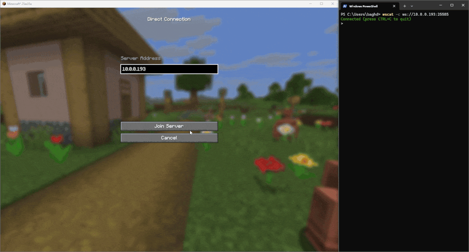

# Not Enough (Server) Management
*Extend and enhance Minecraft's built-in Server Management Protocol (JSON-RPC over WebSocket)*.

[](https://modrinth.com/mod/not-enough-management)

A server-side Fabric Mod for Minecraft [25w35a](https://www.minecraft.net/en-us/article/minecraft-snapshot-25w35a) / 1.21.9+.
The **Minecraft Server Management Protocol** provides an API over websocket that allows you to get live updates, change values, and request information from/to a Minecraft server without much hassle.
Communication is done both-ways with JSON objects.



## 🧩 Features

### [The vanilla Server Management Protocol features can be found on the wiki.](https://minecraft.wiki/w/Minecraft_Server_Management_Protocol)

### Notifications

| Path            | Description           | Parameters                             | Example Response                                                                                                                                                |
|-----------------|-----------------------|----------------------------------------|-----------------------------------------------------------------------------------------------------------------------------------------------------------------|
| `/chat_message` | Player's Chat Message | message: [Chat Message](#chat-message) | ```{"jsonrpc":"2.0","method":"notification:chat_message","params":[{"id":"e68e2363-f1bb-446c-aeef-cccd23aeafb7","name":"DanMizu","message":"Hello World!"}]}``` |

### Schema

#### Chat Message
- 🆔 `id`: string
- 👤 `name`: string
- 💬 `message`: string

## ⬇️ Installation

1. Enable the Server Management Protocol/Management Server in your `server.properties` file.
- `management-server-enabled`
  - default `false`
  - **set to** `true`
- `management-server-host`
  - default `localhost`
  - **keep set to** `localhost`
> [!WARNING]
> Ideally you keep this set to `localhost` and only run services that need to access the server on the same machine.
> If you trust everyone that's connected to your local network *(you shouldn't!)*,
> then set to `0.0.0.0` to allow other machines on the same network to access the server.
- `management-server-port`
  - default `25585`
  - **set to an unused port if the default port is taken by another service on your machine**
> [!CAUTION]
> DO NOT FORWARD THIS PORT (Port-forwarding).
> There is no authentication built into the management server and anyone that can connect essentially has full control over your server.
> You're recommended to run services that use it on the same machine and keep `management-server-host` set to `localhost`.

2. Download this mod, making sure to match it to the minecraft version of your fabric server.
3. Add the downloaded `.jar` file of this mod into your `mods` folder in your server, and start/restart.

## ▶️ Usage

You can use this with anything that can connect over websockets. 
This example uses [Node.js](https://nodejs.org/en), specifically the [wscat](https://www.npmjs.com/package/wscat) package. 
If you want to follow along, make sure to first install Node.js and NPM 
*(NPM should be automatically installed alongside Node.js)*.

1. Install properly onto your Fabric Minecraft server as detailed in [Installation](#-installation) and run the server.
2. Open a terminal application.
3. Install wscat globally using NPM if you haven't already: `npm install -g wscat`.
4. Run the command `wscat -c ws://<management-server-host>:<management-server-port>`
5. Log into your Fabric Minecraft server with your Microsoft account.
6. Send a chat message in-game, and you should see a notification pop up in the terminal application with relevant information.